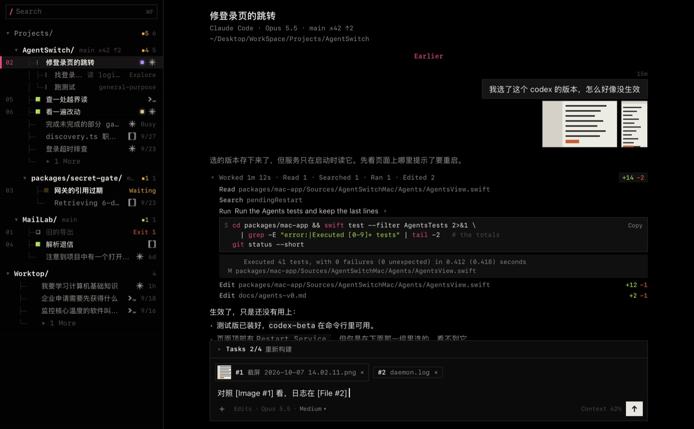
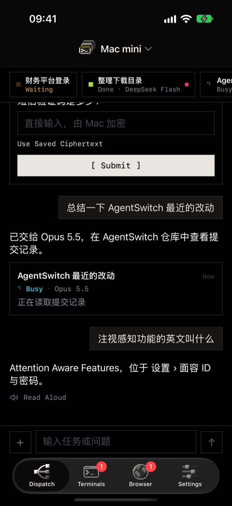
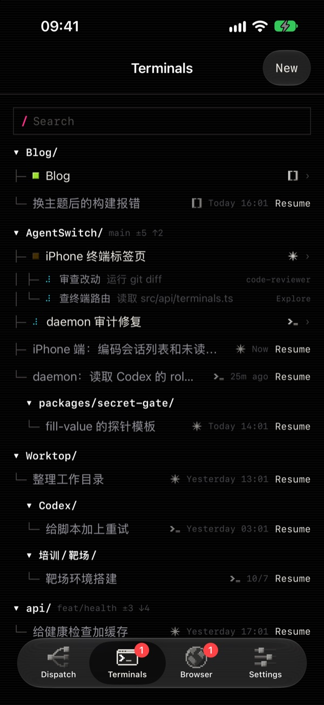
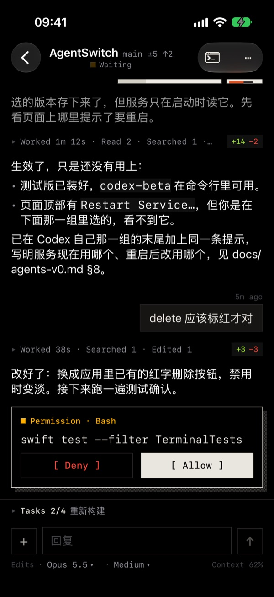
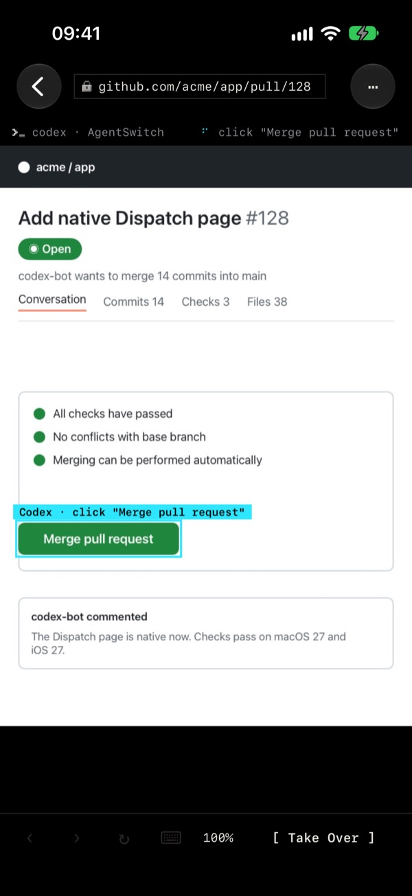
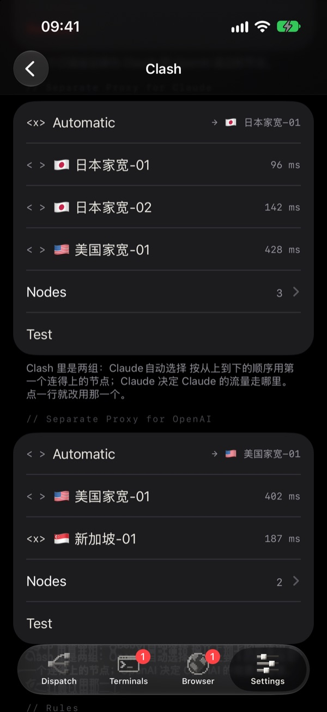
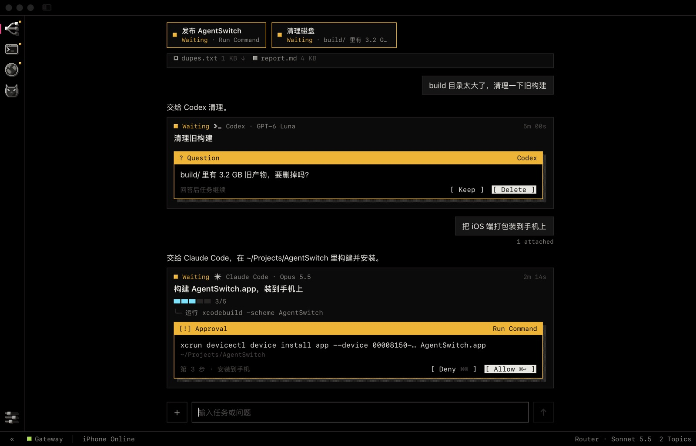
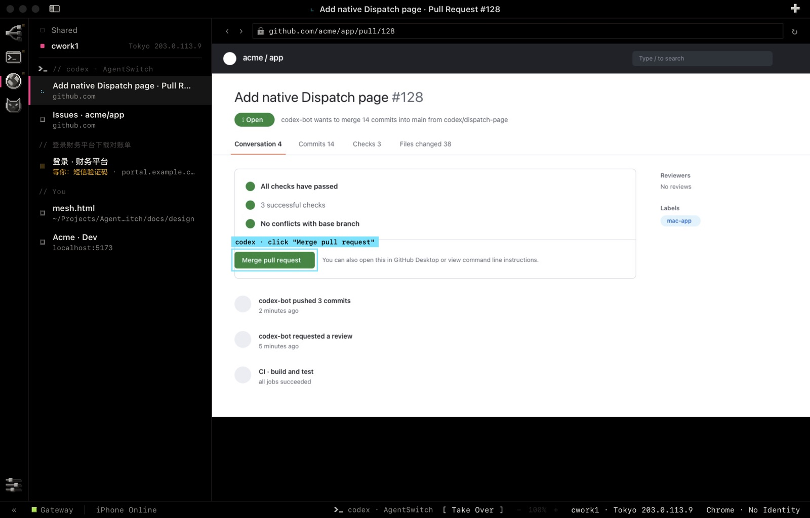
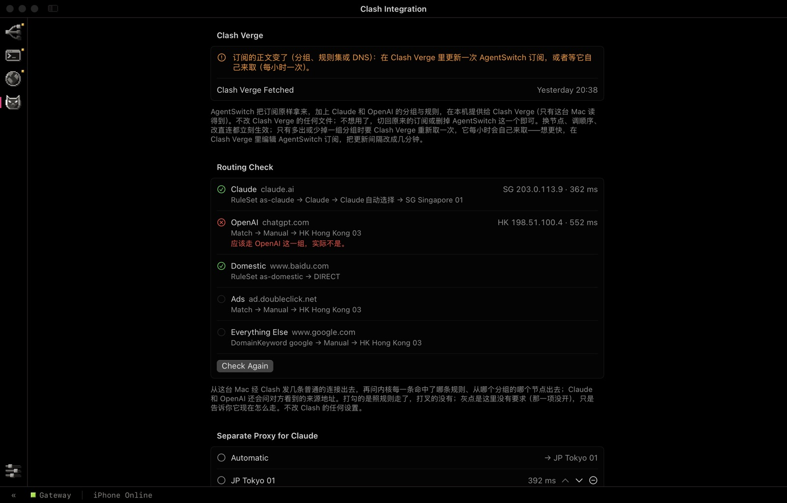

# AgentSwitch

Run the AI coding agents on your Mac — Claude Code, Codex, OpenCode, pi — from your iPhone, and from one window on
the Mac itself. AgentSwitch is the layer around them: it starts them, shows what they do, asks you when they need a
yes, and keeps your passwords out of what they read.

It leaves no trace in the agents. A session made here is the agent's own session, in the agent's own files, as if
its own CLI had made it: you can stop using AgentSwitch at any point and carry on in the CLI, or in another tool.

Early stage, one person's project. The design notes in `docs/` are in Chinese and most are marked as drafts; start
with `docs/design-v0.md`.

<p align="center">
  
</p>
<p align="center">
  
  
  
  
  
</p>
<p align="center"><sub>
  The Mac's Terminals page; on the iPhone: Dispatch, Terminals, a session waiting for a permission, the browser, Clash.
  Every picture here is the apps' own demo data.
</sub></p>

## What is in it

| | on the Mac | on the iPhone |
|---|---|---|
| **Dispatch** — say what you want; a router picks the agent and the model, the task runs in the background, and dangerous steps wait for your approval (`docs/dispatch-v0.md`, `router-v0.md`, `loop-v0.md`, `threads-v0.md`) | main window, first page | `Dispatch` tab |
| **Terminals** — the agents' own CLIs in terminals the service holds, so the same session is open on both screens; a folder tree, search, git, split panes, and a simple view that shows a session as a conversation (`docs/terminal-v0.md`, `simple-view-v0.md`) | `Terminals` page | `Terminals` tab |
| **Browser** — one browser the service holds (Camoufox), which you and the agents share: a real window on the Mac, a live picture on the phone; take a tab over, hand it back (`docs/browser-v0.md`) | `Browser` page | `Browser` tab |
| **Profiles** — several sign-ins for one agent, each with its own colour, its own proxy and its own browser; chosen where a terminal is made or a conversation resumed. Claude Code first (`docs/profiles-v0.md`) | Settings › Agents | a `Profile` row when making a terminal, `Resume As` on a conversation |
| **Proxies** — Clash Integration (a separate way out for Claude and for OpenAI, on top of your own subscription, handed to Clash Verge), a profile's own proxy, the shared browser's proxy (`docs/clash-v0.md`) | `Clash` page, Settings › Agents, `Browser` page | Settings › Proxies |
| **Credentials** — agents only ever see `enc:v1:` ciphertext; a local gate turns it into the value at the network layer or in a browser form, for the sites it was sealed for (`packages/secret-gate`, `docs/gate-service-v0.md`) | Settings › Keys | Settings › Ciphertexts |
| **Agents** — the four CLIs installed, updated and switched between versions (`docs/agents-v0.md`) | Settings › Agents | — |

Also: a Live Activity on the lock screen and in the Dynamic Island, the same card in the Mac's menu bar, usage of
each agent's quota, a web console, and two looks for every screen (`Pixel`, `Classic`; `docs/ui-v0.md`).

## A closer look

**Terminals.** The picture at the top: every session of every agent, filed by the folder it runs in — running ones
first, with their state, their sub-agents, and a lit dot in the colour of the profile they run under. A session opens
as its real terminal or, as here, in the simple view: what you said, the answer set as Markdown, a run of tool calls
folded into one line that opens onto the command and its output, what the turn changed, and a reply box that takes
pictures and files. The same session can be picked up on the phone.

**Dispatch.** One input box. The router hands each request to an agent and a model and says which; the task runs in
the background, and what needs you — a question, a command to approve — is answered in place, from either screen.

<p align="center">
  
</p>

**Browser.** A browser the service holds. An agent's tab shows what it has just done, outlined on the page; `Take
Over` makes the tab yours until you hand it back. A profile has a browser of its own, with its own
sign-ins, leaving through its own proxy — the list on the left switches between them.

<p align="center">
  
</p>

**Clash.** Claude and OpenAI each get their own group of nodes on top of the subscription you already have, handed
to Clash Verge without editing its files. The routing check sends one connection of each kind through the running
core and says where it went — here, OpenAI is not going through its group yet.

<p align="center">
  
</p>

## How it fits together

```
iPhone app ──HTTPS, pinned certificate, device token──▶ ┐
            (same Wi-Fi, or Tailscale)                   │
Mac app (menu bar + main window) ──HTTP, 127.0.0.1──▶ agentswitchd ──▶ Claude Code · Codex · OpenCode · pi
   └ ships and supervises: Node, Python, the daemon, secret-gate     ├─ terminals it holds
                                                                     ├─ the browser it holds
                                                                     └─ secret-gate (decrypts at the edge)
```

The phone pairs once by QR code. After that it reaches a fixed list of routes and nothing else
(`packages/daemon/src/remote/routes.ts`, `docs/app-v0.md` §2); a lost phone is removed on the Mac. What each entry
point may and may not do with a secret is listed in `packages/secret-gate/BOUNDARY.md`.

## Packages

Each one stands alone — its own dependencies, tests and README — and they talk only over processes and the network.

| package | what |
|---|---|
| `packages/daemon` | TypeScript service: task engine (SQLite, SSE, approvals), router, HTTP API, the remote listener for phones, terminals, the browser, profiles, Clash Integration, quota; CLI `bin/agentswitch` |
| `packages/mac-app` | macOS app (SwiftUI): menu bar and main window; bundles Node, Python, the daemon and secret-gate and keeps them running; pairing, devices, keys, agents |
| `packages/ios-app` | iPhone app (SwiftUI, iOS 17+): `AgentSwitchKit` (pairing, certificate pinning, sealing on the phone, event streams) and the screens |
| `packages/secret-gate` | Python credential layer: keypairs, ciphertext and short references, the decrypting proxy, the browser fill gate, MCP tools for the agents |
| `packages/secret-gate-ui` | macOS app for the gate alone: named keypairs, single and batch sealing, through the secret-gate CLI |

## Build

Needs an Apple Silicon Mac on macOS 14 or newer, Xcode with its iOS platform, and
[xcodegen](https://github.com/yonaskolb/XcodeGen). The agents themselves are your own installs and sign-ins; the app
finds them, or installs them for you.

```bash
# The Mac app: a self-contained AgentSwitch.app (downloads pinned Node and Python on the first run)
cd packages/mac-app && scripts/build-app.sh          # → build/AgentSwitch.app

# The iPhone app
cd packages/ios-app
scripts/build-sim.sh                                 # simulator
TEAM=<your team ID> scripts/install-device.sh        # your iPhone; a free Apple ID works, for 7 days at a time
```

Open the Mac app, follow its first-run steps, and scan the pairing code with the iPhone app. Each package's README
has the details: `packages/mac-app/README.md`, `packages/ios-app/README.md`, `packages/daemon/README.md`.

## Test

No test calls a real model. Scripts that do are under each package's `scripts/` and are run by hand.

```bash
cd packages/daemon      && npm install && npm test   # vitest
cd packages/mac-app     && swift test
cd packages/ios-app     && swift test                # AgentSwitchKit
cd packages/secret-gate && .venv/bin/pytest
```

The screens can be looked at without a Mac service or a phone: the Mac app draws any page to a picture
(`-designPreview <dir>`), the iPhone app opens on sample data (`-uiDemo YES -uiDemoScreen <name>`), and
`docs/design/index.html` lists the demo pages the screens are built from.

## Where to read

- `docs/design-v0.md` — the whole, and why
- `docs/app-v0.md` — the two apps, pairing, what a phone can reach
- `docs/ui-v0.md` — how the screens look and how they are worded
- `docs/terminal-v0.md`, `docs/browser-v0.md`, `docs/profiles-v0.md`, `docs/clash-v0.md` — the parts above
- `docs/design/` — the demo pages; `docs/showcase/` — every screen on one page
- `CLAUDE.md` — the index of all design notes and the conventions the code follows
